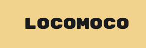
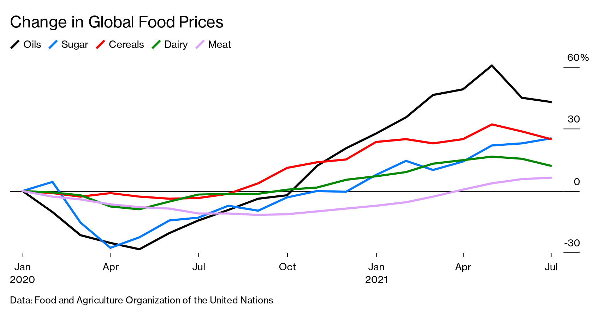
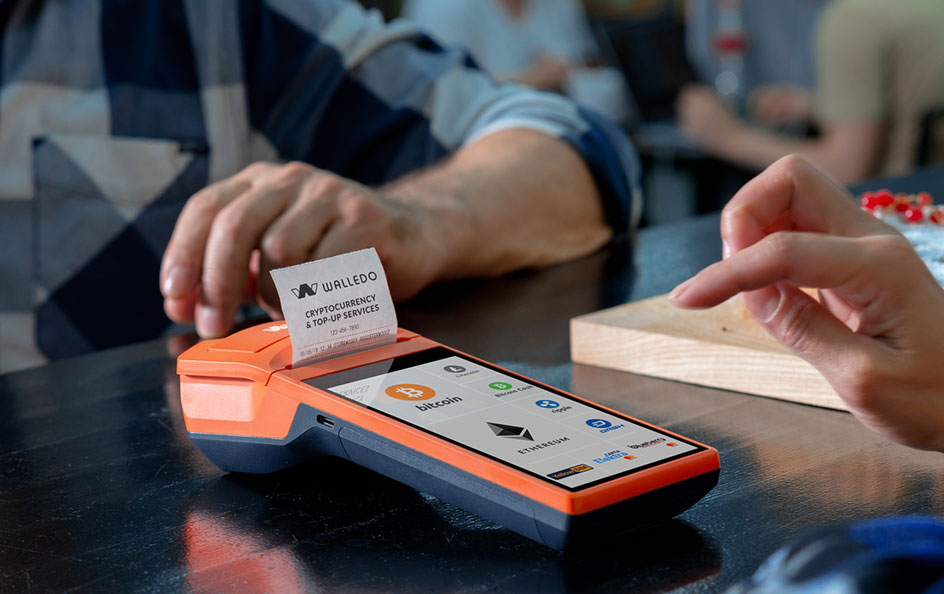
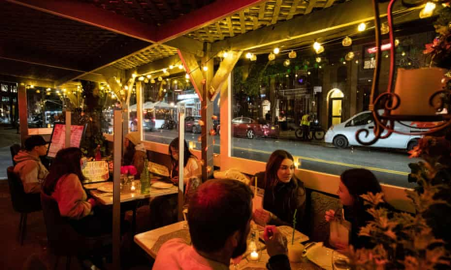
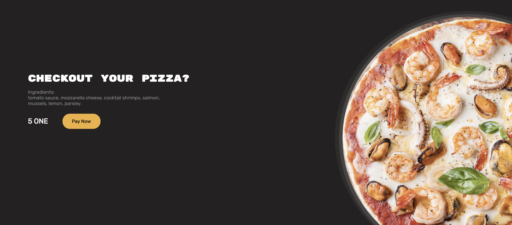

<h1 align="center" style="display: block; font-size: 2.5em; font-weight: bold; margin-block-start: 1em; margin-block-end: 1em;">
<a name="logo" href="https://harmony-one-web.vercel.app/"></a>
</h1>


# LocoMoco

## Introduction[](#introduction)

LocoMoco is a web3 application coupled with smart contracts deployed on the Harmony chain used by restaurants to raise capital from local supporters via NFTs in a decentralized manner.

There is a current need for alternative cash flow in the restaurant industry as the pandemic applies unprecedented pressure. As a wave of support from community members encouraging local business patronage continues to grow, LocoMoco aims to empower local restaurants and welcome them into the benefits of blockchain technology.

LocoMoco does this by enabling restaurants to raise a desired amount of funding by minting and selling their own NFTs on the HarmonyOne Blockchain. Supporters buy the NFTs of restaurants to gain access to special perks and merchandise.

---

## Table of contents[](#table-of-contents)
1. [Motivation](#motivation)
1. [How it works](#how-it-works)
1. [Composition](#composition)
1. [Why Harmony?](#harmony)
1. [Use cases and benefits](#use-cases-and-benefits)
   - [Offsetting rising food costs](#offsetting-rising-food-costs)
   - [Implementing new technology](#implementing-new-technology)
   - [Outdoor seating](#outdoor-seating)
1. [Examples](#examples)
1. [How to Deploy Smart Contract](#deployment)
1. [Licensing](#licensing)
---

## Motivation[](#motivation)

Now, local restaurants are being challenged by rising food costs, supply chain issues, and employee acquisition. "Total restaurant sales trended higher in recent months, though essentially all of that growth can be attributed to rising menu prices". [[source]](https://restaurant.org/research-and-media/research/economists-notebook/analysis-commentary/real-restaurant-sales-remained-flat-in-recent-months/)

In their [2021 Mid-year State of the Restaurant Industry Report](https://restaurant.org/research-and-media/media/press-releases/national-restaurant-association-releases-2021-mid-year-state-of-the-restaurant-industry-update/), the National Restaurant Association stated that 52% of adults would like to see restaurants incorporate more technology to make ordering and payment easier and 84% of adults say they favor allowing restaurants to set up tables on sidewalks, parking lots or streets permanently.


*This chart examines total revenue at restaurants in our analysis in 2020 compared to total revenue at restaurants on a similar day in 2019. [[source]](https://www.womply.com/blog/data-dashboard-how-coronavirus-covid-19-is-impacting-local-business-revenue-across-the-u-s/)*

Through LocoMoco, our team wants to inject funding into local restaurants to continue serving their communities. We are targeting local restaurants that have the drive to stay in business and meet consumer requests, such as incorporating more technology and outdoor seating. These business improvements cost money, and LocoMoco aims to tackle this challenge head-on. 

---

## How it works[](#how-it-works)


---

## Composition[](#composition)

LocoMoco consists of:
1. A [Website](https://harmony-one-web.vercel.app/) for restaurants to mint and customers to purchase NFTs. It is built using Typescript, React, and Web3 technology.
2. [Smart Contracts](FILL IN RELATIVE GITHUB PATH) to facilitate the creation, transaction, and delivery of NFTs between restaurants and supporters on the Harmony testnet.

---

## Why Harmony?[](#harmony)

LocoMoco's goal is to put supporter funding into restaurants' hands inexpensively and quickly - this is where Harmony comes in. We love Harmony's 1000 times lower fees, 2-second transaction finality, and secure bridges to transfer assets across different chains. A big part of LocoMoco is transactions between restaurants and their supporters and, consequently, the gas fees. With Harmony, we can support low-cost transaction fees, putting our service in reach of more restaurants.


## Use cases and benefits[](#use-cases-and-benefits)


### Offsetting rising food costs 
A restaurant's profit margin is being squeezed by rising food costs caused by supply chain issues and inflation. The owner must decide to pass the increased cost to their customers by raising menu prices. The owner opts to use LocoMoco to raise capital to offset the rising costs caused by short-term supply chain challenges.



### Implementing new technology
On-premise, a restaurant uses a standard POS (point of sale) system that does not support online ordering or advanced payment methods such as ETH, Venmo, or ONE. The restaurant owner is unable to justify a purchase of a new POS system due to tight profit margins. The restaurant owner uses LocoMoco to raise capital through the minting of 10 NFTs that give its holders special perks. Now, the restaurant owner can satisfy customer wants of restaurant technology without using valuable, sparse capital.



### Outdoor seating
A restaurant owner wants to build an outdoor seating arrangement that costs $10,000, including overhead tents, safety barricades, and lighting. The restaurant owner uses LocoMoco to mint 100 NFTs which gives its holder priority seating. With the new capital raised through the NFT sales, the restaurant owner can build the outdoor seating arrangement, attracting new customers and appeasing the consumer's want for outdoor seating.



---

## Examples[](#examples)

[](https://harmony-one-web.vercel.app/pizzacheckout)

---

## How to Deploy Smart Contract[](#deployment)

```shell
# Step 1: Get resources from Github
$ git clone https://github.com/Harmony-One-Hackathon/contracts-2
$ cd contracts-2

# Step 2: Install Dependencies
$ yarn install
$ npm install -g truffle

# Step 3: Compile and Deploy MembershipFactory contract
$ truffle compile
$ truffle deploy --network testnet
```

Only the MembershipFactory contract is deployed on the testnet. The Membership contract (between the restaurant and the supporter) is created dynamically through the `deployMembershipContract` function in the MembershipFactory contract. 

---

## Licensing[](#licensing)

Distributed under the MIT License. See `LICENSE.txt` for more information.

---

## The Team

[](https://www.linkedin.com/in/codyenokida/)
[](https://www.linkedin.com/in/brandonkhong/) 
[](https://www.linkedin.com/in/tetsuya-vlaming/)
[](https://www.linkedin.com/in/derektchang/)

